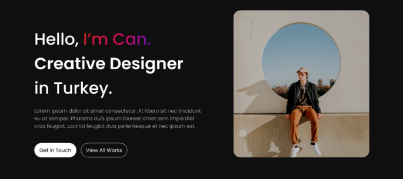
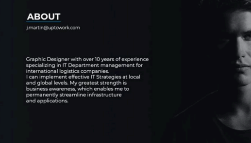
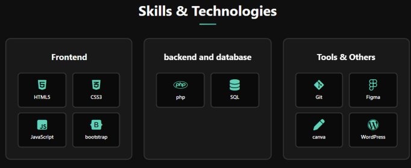
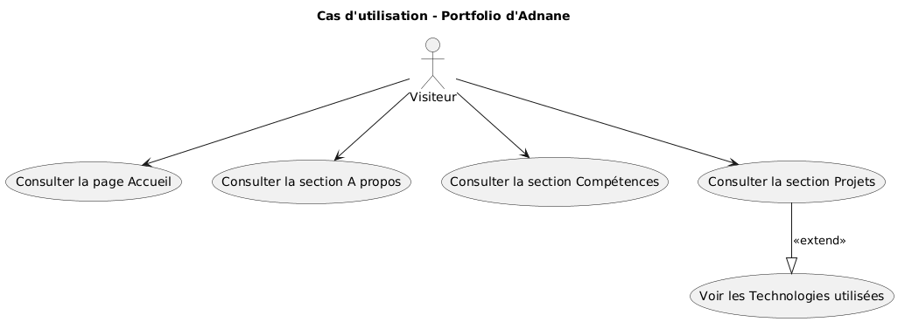
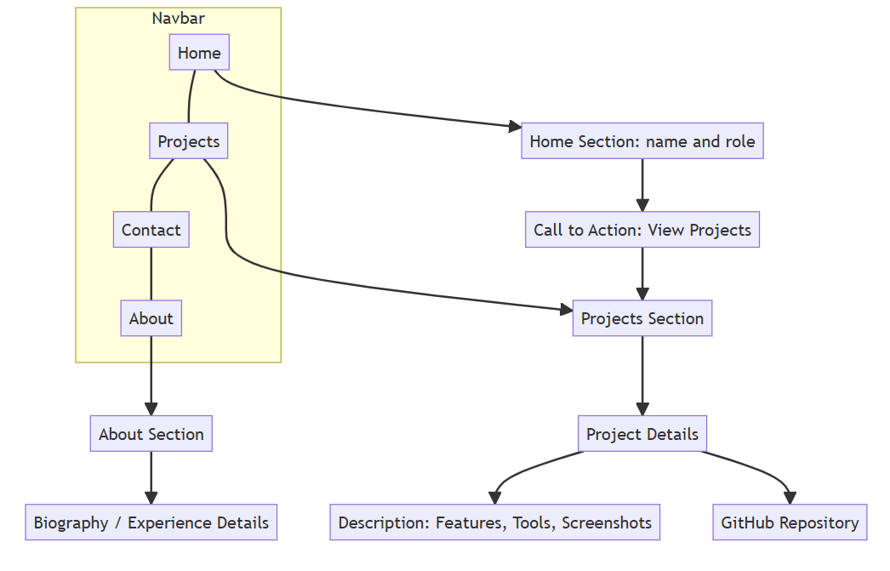
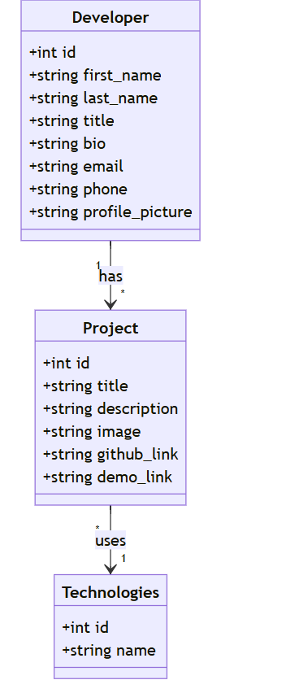
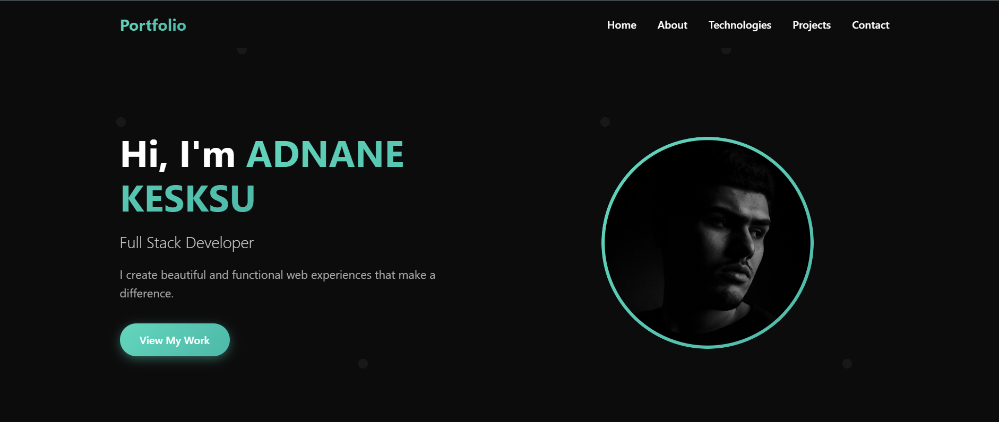

Portfolio Project

by Adnane Kesksu

---

## Besoins de Ayoub Jalyta

* Mettre en valeur mes compétences  
* Présenter mes projets  
* Augmenter ma visibilité  
* Créer des opportunités professionnelles  

### Technologies : Laravel

### Fonctionnelles

1. Accueil (Home)  
2. À propos (About / Bio)  
3. Compétences (Skills)  
4. Projets (Projects / Portfolio)  
5. Contact  

---

# Exemple de l'existant

  
  

  

---

# Diagramme de cas d'utilisation

  

---

# Conception

  

---

# Diagramme de classe

  

---

#  Maquette

  

