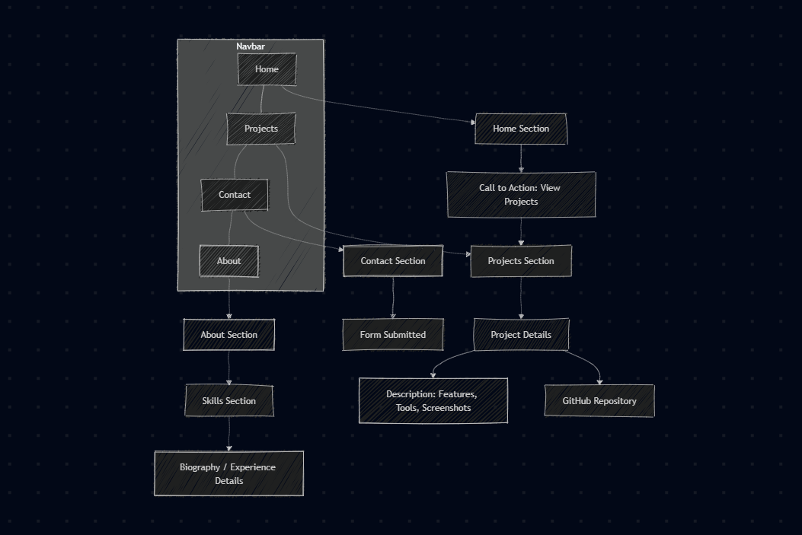

# Portfolio Project

    by Adnane Kesksu

---

## besoins de Ayoub jalyta

* Mettre en valeur mes compétences  
* Présenter mes projets  
* Augmenter ma visibilité  
* Créer des opportunités professionnelles  

### Technologies : **Laravel**

## Fonctionnelles

1. Accueil (Home)  
2. À propos (About / Bio)  
3. Compétences (Skills)  
4. Projets (Projects / Portfolio)  
5. Contact  

    by Adnane Kesksu

---

# Exemple de l'existant

    <!-- Première rangée : 2 images côte à côte -->
    

        
    

    

        
    

      

        
    

  
  

---

# Diagramme de cas d'utilisation

    

---

# Conception

    

